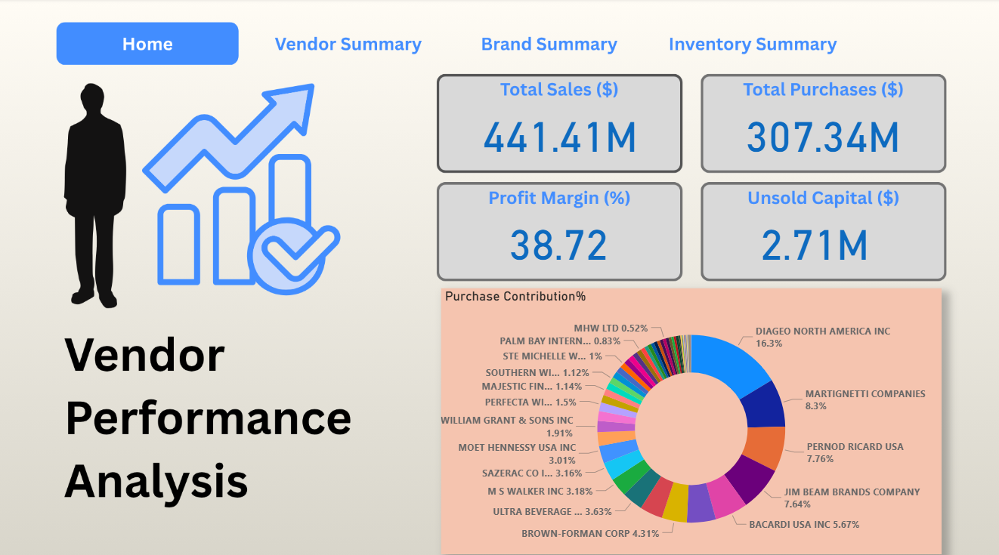

# 📊 Vendor Performance Analysis

This project provides a comprehensive analysis of vendor performance based on purchase, sales, and logistics data. It helps businesses make informed decisions on vendor selection, pricing optimization, and inventory efficiency using statistical methods and visualization tools.

# My Project

Here are some screenshots:

### 📸 Dashboard Screenshot

---

## 📁 Project Structure

- `Exploratory Data Analysis.ipynb`: Cleans, merges, and profiles raw data from MySQL.
- `Vendor Performance Analysis.ipynb`: Performs statistical analysis, hypothesis testing, and visualizations.
- `Power BI Dashboard`: Visual representation of KPIs, insights, and vendor metrics (optional frontend).
- `vendor_sales_summary` : The final merged dataset used for modeling and reporting.

---

## 🎯 Objectives

- Analyze vendor profitability using metrics like Gross Profit, Profit Margin, and Stock Turnover.
- Identify high-performing vs underperforming vendors.
- Enable data-driven procurement and pricing strategies.
- Visualize trends and insights using Python (Seaborn, Matplotlib) and Power BI.

---

## 🛠️ Tools & Technologies

- **Python**: Data processing, EDA, statistical testing
- **MySQL**: Source database for purchase and sales data
- **Pandas, NumPy**: Data wrangling and transformation
- **Matplotlib, Seaborn**: Data visualization
- **SQLAlchemy**: Database connectivity
- **Power BI**: Interactive dashboard and reports

---

## 📊 Key Metrics

| Metric           | Description |
|------------------|-------------|
| Gross Profit     | Sales – Purchase Cost – Freight |
| Profit Margin    | Gross Profit / Sales |
| Stock Turnover   | Sales Quantity / Purchase Quantity |
| Freight Impact   | Analyzed how freight affects vendor profitability |
| T-Tests          | Compared means of key metrics between groups |

---

## 🔍 Insights

- Vendors with high freight charges tend to lower overall profit margins.
- Some vendors with low purchase prices still perform poorly due to low turnover.
- A small group of vendors contributes to a majority of profits (Pareto Principle).
- Profit margin and stock turnover are not always positively correlated.

---

## 📌 Suggested Actions

- Re-negotiate with low-margin vendors or replace them.
- Optimize freight strategy to reduce overhead.
- Set turnover benchmarks to prevent overstocking.
- Focus on vendors with consistent high profitability and efficiency.

---

## 🖼️ Power BI Dashboard (Optional)

- KPI Cards: Gross Profit, Stock Turnover, Profit Margin
- Chiclet Slicer: Navigate insights by vendor
- Bar Charts: Unsold Inventory, Gross Profit
- Scatter Plots: Turnover vs Profitability

---

